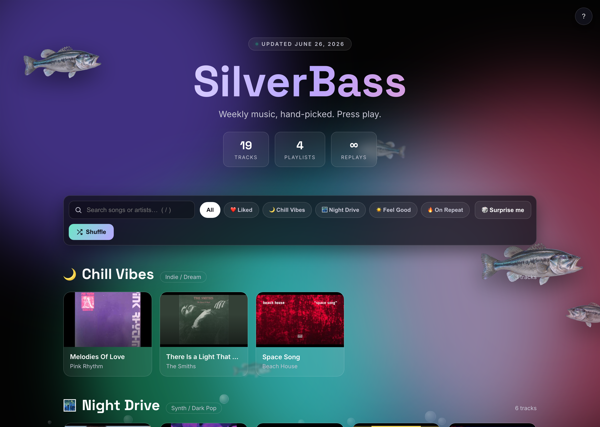

<div align="center">

#  SilverBass 

### A weekly, hand-picked music playlist — with a built-in player. Press play. 🎧


**[▶ Open the live site](https://ailynux.github.io/silverbass/)**

</div>

---

SilverBass turns a simple `playlist.yml` file into a **gorgeous, fully-interactive music site**. Add a song's title, artist, and YouTube link — the generator does the rest: it pulls the cover art, builds the cards, and wires up a real player. No frontend code required to update your music.

<div align="center">
    
</div>

---

## ✨ What it does

- **🎛️ Built-in player** — click any track and a sticky "Now Playing" bar slides up with play/pause, previous/next, **shuffle**, **repeat**, autoplay-next, a scrubber, and a live **audio visualizer**. Powered by the YouTube IFrame API.
- **🖼️ Automatic cover art** — album/video thumbnails are pulled straight from each YouTube link. Just paste a URL.
- **❤️ Likes that stick** — heart any track and it's saved in your browser, with a dedicated "Liked" filter.
- **🔗 Shareable deep-links** — the Share button copies a link that opens the site *already cued to that song* (native share sheet on mobile).
- **🔎 Live search & genre chips** — filter every song/artist as you type, or jump between playlists instantly.
- **🐟 Underwater easter eggs** — a school of 3D silverbass swim by, bubbles drift up, and clicking a fish starts a "feeding frenzy".
- **⌨️ Keyboard shortcuts** — `space`, `←/→`, `s`, `r`, `l` like, `c` copy link, `/` search, `?` help.
- **💎 Premium UI** — animated aurora background, glassmorphism cards, per-playlist accent colors, fully responsive.
- **🤖 Hands-off updates** — GitHub Actions rebuilds and redeploys the site on every push (and weekly).

---

## 🧱 How it works

```
playlist.yml  ──►  main.py (Jinja2)  ──►  docs/index.html  ──►  GitHub Pages
   your music        generator            the website          the internet
```

| Tech | Role |
| --- | --- |
| 🐍 **Python** | Reads the YAML, extracts YouTube IDs + cover art, renders the page |
| 🧩 **Jinja2** | `templates/index.html.j2` — the page template |
| 📑 **YAML** | `playlist.yml` — your single source of truth for songs |
| 🎮 **Vanilla JS** | The player, search, and filters (no frameworks) |
| 🐋 **Docker** | Reproducible build environment |
| 🔧 **GitHub Actions** | Weekly + on-push build & deploy |
| 🌐 **GitHub Pages** | Hosting |

---

## 🚀 Quick start

```bash
# 1. Clone
git clone https://github.com/ailynux/silverbass.git
cd silverbass

# 2. Install + build (Python)
pip install -r requirements.txt
python main.py

# 3. Preview
open docs/index.html
```

Prefer Docker?

```bash
docker build -t silverbass .
docker run --rm -v "$PWD/docs:/app/docs" silverbass
```

---

## 🎵 Adding songs

Edit `playlist.yml` — that's the only file you touch:

```yaml
playlists:
  - theme: "Chill Vibes"
    emoji: "🌙"
    genre: "Indie / Dream"
    accent: "#7c5cff"      # optional accent color for this set
    songs:
      - title: "Space Song"
        artist: "Beach House"
        url: "https://www.youtube.com/watch?v=RBtlPT23PTM"
```

Run `python main.py` (or just push — Actions handles it) and the new track shows up with cover art and full playback. ✨

---

## 🎉 Connect

- 💻 [GitHub](https://github.com/ailynux)
- 👔 [LinkedIn](https://www.linkedin.com/in/ailyndiaz01)

<div align="center">

⭐ Star the repo if SilverBass made your week sound better.

[](https://git.io/typing-svg)

</div>
